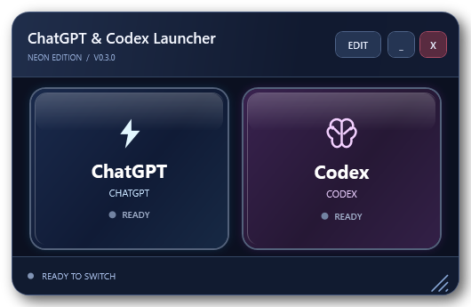
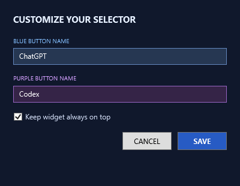

# ChatGPT & Codex Launcher

A small floating Windows widget for switching an already-open ChatGPT desktop app between **ChatGPT** and **Codex**.

Two buttons, editable names, and an optional always-on-top window. The launcher sends the same keyboard shortcuts you could press yourself.



*Rendered preview of the shipped interface. No desktop or chat content is shown.*

## Why we made it

Switching between ChatGPT and Codex felt clunky and confusing in our everyday use. We wanted a clear choice we could see and reach, so we made a small floating widget with two straightforward buttons.

It keeps the existing app shortcuts and puts the choice within easy reach, with editable labels and an optional always-on-top window.

## Download and run

1. [Download the latest Windows ZIP](https://github.com/Wilsonious/chatgpt-codex-launcher/releases/latest/download/ChatGPT-Codex-Launcher-v0.3.0-Windows.zip).
2. Review the included source before running it. If the ZIP's **Properties** window shows **Unblock**, select it only if you trust the download, then apply the change.
3. Use **Extract All** to unpack the ZIP into a normal folder you can write to. Run the launcher from the extracted folder.
4. Open the **ChatGPT Windows desktop app** and sign in.
5. Double-click **Start-Launcher.cmd**.

For easier access, create a Windows shortcut to `Start-Launcher.cmd`.

This is a portable script package, with no installer and no administrator requirement. It does not start ChatGPT or open a browser.

## What the buttons do

| Button | Action in the accepted v0.3 build |
| --- | --- |
| **ChatGPT** — blue | Focuses a detected ChatGPT desktop window and sends **Alt+3**. On the original tested PC, this selected ChatGPT. |
| **Codex** — purple | Focuses a detected ChatGPT desktop window and sends **Alt+1**. On the original tested PC, this selected Codex. |

These shortcut mappings are fixed in the source. ChatGPT app versions or configurations may map them differently; check the shortcuts in your own app before relying on the labels.

The selected card shows the **last mode requested by the widget**. It does not read the app's current mode or confirm that the switch succeeded.

## Using and customizing the widget

- Move it using the title area; resize it from the lower-right corner.
- Use the minimize and close controls as usual.
- Select **EDIT** to change the two button names or the always-on-top setting.
- Button names change the labels only. They do not change the shortcuts or add new launch actions.



*Rendered preview of the shipped interface.*

Settings are saved locally in `%APPDATA%\NeonChatSelector\settings-v0.3.json`. An existing v0.3 settings file is reused, including its saved button names. Fresh settings use **ChatGPT** and **Codex**. Personal settings are not included in the download.

See [customization and troubleshooting](docs/CUSTOMIZATION.md) for reset steps and source-level changes.

## Requirements

- A Windows 10 or Windows 11 desktop session.
- Windows PowerShell **5.1**, with .NET Framework/WPF available.
- Windows Script Host's `WScript.Shell` component available for keyboard input.
- The ChatGPT Windows desktop app already running. Detection looks for the `ChatGPT` process with a window title containing `ChatGPT` or `Codex`.
- Permission to write to your roaming application-data folder.

There are no third-party PowerShell modules, npm packages, API keys, or REAPER dependencies.

Jack live-tested the original v0.3 launcher and its edit controls on his Windows PC. The public branding update on **2026-10-08** changes default labels, display text, and comments while preserving that accepted behavior. Other Windows and ChatGPT app versions have not yet been independently validated.

## Known limits

- It switches the detected ChatGPT desktop window; it does not detect or control a separate standalone Codex app.
- Changes to the app's process name, window title, or keyboard shortcuts may prevent switching.
- Switching relies on foreground-window focus. If another window takes focus at the wrong time, the shortcut may miss its intended target. Avoid typing while the widget is switching.
- The highlight can remain selected even if switching failed or you later changed modes inside ChatGPT.
- Saved window coordinates may put the widget off-screen after a display change. [Resetting the settings](docs/CUSTOMIZATION.md#reset-settings) restores the defaults.

## Security and privacy

The launcher sends focus requests and keyboard input. It does not make network requests, collect telemetry, read chat content, or use an API key. The ChatGPT app has its own account, network, and privacy behavior.

The included source is unsigned. `Start-Launcher.cmd` starts Windows PowerShell with an execution-policy override for that process only; it does not change the machine's saved policy. Organization policies may still block it. Follow your organization's IT guidance if you use a managed device.

Read the [security and privacy notes](docs/SECURITY.md) before running downloaded scripts.

## Uninstall

Close the widget, then delete the extracted folder and any shortcut you created. To remove its saved preferences as well, delete only `%APPDATA%\NeonChatSelector\settings-v0.3.json` while the widget is closed.

## Source and release packaging

```text
Start-Launcher.cmd         Windows launch helper
src/                      v0.3 PowerShell source with public labels
scripts/Build-Release.ps1  Builds the portable ZIP and SHA-256 checksums
docs/                     Customization, security, screenshots, release notes
CHANGELOG.md              Release history
LICENSE                   MIT license
```

To build a release from a source checkout, run this from the repository folder:

```powershell
powershell.exe -NoProfile -ExecutionPolicy Bypass -File .\scripts\Build-Release.ps1
```

The build creates a ZIP and `SHA256SUMS.txt` under `dist/`. See [v0.3.0 release notes](docs/releases/v0.3.0.md) and the [changelog](CHANGELOG.md).

## License

Released under the [MIT License](LICENSE). See [why MIT was chosen](docs/LICENSE-CHOICE.md).

This is an independent utility. It is not affiliated with or endorsed by OpenAI. ChatGPT and Codex are names of OpenAI products; the license covers this launcher, not those products.
